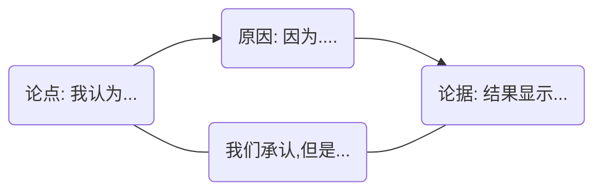

## 第三部分：如何讲好故事

如果说这部分有一个核心的主题的话，那必然是：要让读者相信你写的内容。

**不能等到把所有的信息都收集完整的时候再去考虑故事该怎么写。**

很多时候，研究和写故事是并行进行的，并不是串行的。一开始我们想要研究的可能是A，但是随着研究的进行我们可能发现更适合研究B。这种情况下我们所要讲的故事也会发生变化，我们要收集的信息和要做的实验也会发生变化。另外，有可能，我们一开始做了大量的实验，但是却无法解释实验的结果，最终故事讲不通，就很难让人信服你的研究是有意义的。因此一种比较好的状态就是实验研究和写故事同时进行，写故事一方面解释了实验的结果，另一方面为了故事的完整性和可行性，写作的过程会指导我们收集信息和探究实验。这个故事又可以说是学术论点。

**你不一定做到让读者认同你的观点，但是应该做到和读者一起探索一个重要的问题，并且这个问题是读者所关心的。**

最后读者应该大致有两种结果，一种是读者非常认同你的观点，权力支持你的观点。另一种是读者认为你的观点并不够好，他可以想到一个更好的观点，或者读者会发现你的观点的缺点。我们需要大量的原因和论据来支撑我们的论点。

**在下面的部分中，原因和理由在某些情况下意思是一样的。**

### 论证的概览

论证的过程并不复杂，首先我们提出一个论点，然后用一些原因和论据来支撑我们的论点，你可能需要回复或承认一些其他的观点，此外还要提供一些**逻辑推理的原则**。**写作一个假象的对话，我们要充分考虑种种可能性，以使得我们的论证无懈可击。**

论证基本上包括5个基本要素，这5个基本要素就是读者所发问的一些问题的答案。

- **论点**：你想要我相信什么？你的观点是什么？
- **原因**：为什么你提出了这个？为什么我应该认可你？
- **论据**：你是怎么知道的？你能支撑你的论点吗？
- **承认和回应**：如果怎么怎么样的话。。。（其实我们不得不承认，我们的论点不是全能的）
- **保证**：你的逻辑是什么？你能解释你的推理吗？

#### 论点

- 如何识别不同类型的论点
- 如何判断论点是否够具体
- 如何判断论点是否有意义

**论点的分类**

- 声明一些客观事实
- 声明一些定义和分类
- 声明一些原因和结果
- 声明一些评估
- 声明一些实际的策略或行为

让声明成为实际的声明：

- 解释为什么你的答案是可行的。
- 解决问题的代价要小于不解决问题的代价
- 这不会创造更大的问题
- **为什么这个算法更快更便宜**

**一个具体的声明应该是什么样子**

一个更一般的范式：`Althoght I acknowledge X, I claim Y because of reason Z.`

**让声明变得更重要**

下面根据重要性进行简单的分级：

1、研究为大家感兴趣的话题提供了新的证据。

2、不仅仅是把实验数据展示出来，还利用这些数据回答了一些困惑、有争论的问题。

3、长期的事实被颠覆。

一种判断声明是否很重要的方发生是：把结论取反。如果反过来的版本也很一般，那么这种声明重要性就不强。一般人也不必追求做出重大的发现，其实我们能够做一个小发现，能启发别人继续去做一些工作，也是挺好的。

**让论点更可信**

1、话不要说太满。承认在某些条件下，我们的论点可能有问题。

2、使用较弱的语气词。如：with to suggest a point. In out opinion. We believe.

#### 支撑论点

支撑论点的方式有两种：原因和论据。支撑论点的时候要尽可能的丰富一些，包括正面支撑和反面支撑。

读者在阅读的时候，会首先关注故事的核心部分：论点和它的支撑。读者会检查理由的合理性和顺序性，检查逻辑的正确性。如果理由还成立的话，读者会继续查看论据部分，论据部分要能够支撑理由，理由要能够撑起论点。

讲故事（论述）的时候，首先应该给读者提供一些合理的理由；然后这些理由需要在一个清晰的有逻辑的顺序之下；
最后所有这些理由必须要是基于论据的，而且读者是可以接受这些论据的。下面是一个故事的草图:

从引入一个声明开始，我们收集一些理由，并为这些理由提供充足的论据，最终得出结论。

**原因支撑**

原因支撑在结构上很好识别，因为它常常伴随着“因为”等字眼的出现。在语义上，“因为”关键字后面跟的都是原因。此外，一般我们会使用多个原因而不仅仅是一个原因。换种角度，原因也是一种观点，因此它实际上也可以作为分论点存在，我们可以为其提供原因和论据支撑。这样文章结构就会非常饱满。非常像树结构。

**论据支撑**

原因是一种思想上的，逻辑上的东西，它并不具体。而论据是具体的一些东西，比如实验结果，数据分析结果，别人已有的研究结果等。因此，原因必须是基于论据的，否则原因就失去了客观事实的支撑，变成了胡思乱想。这也就是说，原因要有相应的论据支撑。

**区分理由和论据**

理由是逻辑上的，思维上的存在，还是属于比较抽象的一层。而论据是非常可观的，具体的依据。论据可以是实验结果，数据分析的结果，别人的科研成果。如果论据落实的不具体的话，它就有可能被读者误认为是理由。论据要求有非常精确的数字支持而不是模糊的表达，如：the majority, most of, some peoples.

**论据的质量**

一个好的论据应该具有准确性，精确性，充分性，代表性和权威性。

- 准确性：准确的报到论据的来源，确保论据是用Ctrl cv拿来的。如果论据被做了一些修改，那么就要在显眼的地方准确的说明做出了哪些的修改。比如：引用别人的模型在相同的超参数，不同规模的数据集上得到的性能显然会不一样。
- 精确性：论据应该足够的精确。避免在论据上使用some, most, many, almost, often, usually, generally, frequently等不确定的词。
- 充分性：一两个简单的证据不足以说明什么道理。论据要足够充分。
- 代表性：我们要调查北京的人口密度，不能只从天通苑那里采样。充分性和代表性经常是不可分的。
- 权威性：引用的论文的质量必须有保障。发顶会的论文绝大多是的引用都得是顶会的论文。

#### 其他的观点

原因支撑也只能在有限的几个角度上来支撑我们的论点，现实并不是完美的，总会有一些其他不兼容的情况。因此，我们看待和我们的观点不相适应的观点的时候可以采用承认，毕竟没人能提出万能的方案，或者给予强有力的回应，battle掉他发问的勇气。

写作是和读者对话的过程，读者在阅读的过程中会产生各种各样的问题，我们在写作的时候就要预测，承认或回应读者可能产生的问题。实际上，这里最困难的部分不是回应读者可能的问题，而是想到读者可能有的问题。

**找别人来阅读手稿**

一个人的力量毕竟还是太渺小了，两个人可以产生更大的脑洞。往往别人能够发现自己发现不了的问题，这是一个不漏的好方法。

**可能会遇到一些问题是无法回答的**

要纠正一个思想是说我们的文章解决了某一个问题的所有，在绝大部分的情况下，我们的研究工作，只是回答了一个小的问题的一部分，所以肯定会漏想了一些别的部分，以及说跟这个问题更大的一些问题的东西，可能是无法回答的；

有时候承认自己无法回答别的问题也很正常了，大家也是这么理解的。对于无知来讲，知道自己无知的无知和不知道自己无知的无知，后者当然更加无知一点，所以宁可自己做前者。 

怎么样把这个东西给写下来：可以把回应当做一个主论点；然后用前面介绍过的理由和论据来支撑它。

#### 额外的说明 (Warrants)

有的时候原因对论点的支撑并不是很明显，因此我们需要做额外的说明，或者说展示出我们的逻辑。如果你想让读者相信你的逻辑，你可以问自己以下问题：

- 这种担保是否合理？
- 不要覆盖的太广
- 还有没有更好的担保
- 对于领域是不是合适的
- 要能够覆盖论点和原因

使用warrant的集中情况，（或者说讲出隐藏逻辑的几种情况）。

- 读者是外行
- 你的推理原则对你当前的领域而言比较新
- 论点很有争议性，读者很难接受

## 如何阅读一篇论文？
下面的部分是对文献《How to Read a Paper》的读后总结。<a href="http://web.stanford.edu/class/cs343/resources/how-to-read-a-paper.pdf">原文</a>

### 摘要

这篇文章主要是大致的描述了三遍阅读法（*three pass method*），这个三遍阅读法既可用于阅读文献，也可用于文献调查。前段时间看CMU的CSAPP的课程时，就听到老师建议我们至少阅读三遍这本教材。当时不明白为什么这么做，现在我觉得那也可能是出自这里。

无论多么厉害的方法都不能缺少练习，否则方法永远学不会。无论多么厉害的方法都不能一成不变的照搬，一定要在练习中内化成适合自己的方法。

### Three pass method

三遍阅读法最关键的地方就是将阅读的深度划分为三个层次。这样我们在读完每一层次时都可以进行判断这篇论文的质量如何，是不是我所需要的内容，还需不需要继续深入阅读，选择坚持还是放弃。这样就能提高我们的效率，有针对性的进行阅读，避免浪费不必要的时间。

具体来看，每一遍都有指定的目标：

- First pass：
- Second pass：
- Third pass：深入理解文章，把握细节，甚至会对文章提出新的见解

#### 第一遍

第一遍，我们主要是要知道这篇文章在讲什么，第几部分是干什么的（或者子部分的主题是什么），而不需要抓住文章的内容，只是抓住内容的主题。原文说在阅读第一遍的时候大约可以花费5-10分钟的时间，我觉得在看英文文章的时候可能会花费的更久一些。

下面有一些具体的步骤和方法：

1. 仔细阅读标题，子标题，摘要部分，介绍部分
2. 阅读子标题，或者子部分的头部内容。一般来说每一段的头部内容都是主要内容
3. 阅读结论。从这里我们可以知道这篇文章的主要贡献，也许，我们只需要这个结论
4. 浏览参考文献，将其中已经读过的标记出来

在第一遍结束的时候你应该可以回答一下问题：

- 这是什么类的文章
- 文章的内容是关于什么的，用到了什么理论
- 文章的假设是否可靠
- 文章的主要贡献是什么
- 文章的笔法怎么样

当做完这些工作的时候，我们就可以进行做选择了。上面的这些信息足够用于判断这篇文章是否值得深入阅读。

另外这也给了我们写文章的一些启示：如果读者读了一遍我们写的文章并没有抓住文章的主要信息，那么我们的文章可能就会被放弃。

#### 第二遍

在读第二遍的时候，我们只关注要点内容，忽略细节，这有助于记下要点内容。或者在阅读时，我们可以再页边空白处做注释。做注释是非常有效的一种方法，它一方面输出了我们的理解，加深了印象；另一方面会为防止我们忘记灵感。

下面一些具体的步骤和方法：

1. 仔细阅读图像，图表，以及一切其他说明性的内容。这里着重要说明一下：**Common mistakes like these will separate rushed, shoddy work from the truly excellent.  像一些标记不好，结果是否给出了误差等等之类的错误就能够将仓促、粗糙劣质的工作与真正优秀的工作区分开。** 这里给我们的启示就是一定不要觉得某些细节性的工作不重要就随便应付。
2. 标记出还未阅读的参考文章，以便之后阅读。这主要是用来了解文献的背景的。

原文中说这一边可能会花费大约一个小时的时间。在初学者阅读时一定会，而且一定要花费更多的时间去做这一遍。如果你只是参考这篇论文的话，那么读完第二遍已经足够了，不需要往下读了。因此，读完第二遍你应该抓住文章的主要内容，能够对这篇文章做出总结，甚至你可以向其他人讲解这篇论文的论文。这一遍不会涉及到证明等细节性的内容。

#### 第三遍

第三遍阅读基本上就是研究性阅读了，对于那些想深入了解论文的人来说，读第三遍是很有必要的。第三遍的主要内容就是复现论文。复现论文具有非常主要的意义，在这个过程中你不仅可以清楚的明白作者的工作，什么还会遇得作者曾经遇到的问题和假设。也许你会遇到更多的问题，也许你有一个不错的Idea，那么在这个意义上，就可能就有机会完善作者的工作。在这个过程中，你能够见到许多的研究技巧，证明技巧，表达技巧等等，这些都是你可以学习的东西。

这个过程可能会花费4-5个小时，大约是半天的时间，不过这是值得的。最后，你应该能够清楚的描述出这篇文章的结构、优点和不足。最重要的是，你应该能够知道这篇文章最重要的假设，相关的参考文献，在实验和分析上潜在的问题等等。

### 文献调查

做文献调查也可以采用这种方式。不过需要阅读数十篇文章。

1. 首先我们先收集3-5篇文章。把这些文章都浏览一遍，然后读他们的相关工作部分。这样结束后，能够得到一个大纲。也许是很小的一部分，如果幸运的话，有可能是最重要的部分。
2. 在第二步中，在参考文献中查找共享引用和重复的作者姓名。这些一般都是该领域的关键论文和研究人员。把关键论文下载下来放在一边。然后去这些研究人员的网站看看他们最近发表了什么。这将帮助您确定该领域的顶会，因为好的研究人员通常在顶级会议上发表论文。
3. 第三步是去这些顶级会议的网站，浏览他们最近的会议记录。快速的浏览通常可以识别出最近的高质量相关工作。这些论文，连同你先前搁置的那些论文，构成了你调查的第一个版本。把这些文件翻两遍。如果他们都引用了一篇你之前没有找到的重要论文，你可以获取并阅读它，必要时进行迭代。

## Reference

[1] 一些内容参考了b站UP【爱喝水的崩奔】的笔记 <a href="https://www.bilibili.com/read/cv17695445?from=note">here</a>

[2] <a href="http://people.inf.ethz.ch/troscoe/pubs/review-writing.pdf">Writing Reviews for Systems
Conferences</a>