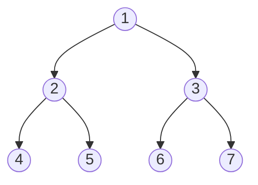
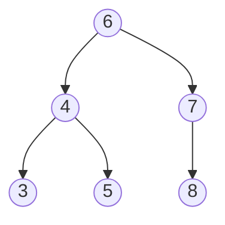

## 排序

- 插入排序
- 选择排序
- 冒泡排序
- 归并排序
- 快速排序
- 堆排序
- 计数排序*
- 基数排序


<center>

<center>时间复杂度和空间复杂度简单总结</center>

|   算法   |  时间复杂度  | 空间复杂度  | 稳定性 |
| :------: | :----------: | :---------: | :----: |
| 插入排序 |  $$O(N^2)$$  |  $$O(1)$$   |  稳定  |
| 选择排序 |  $$O(N^2)$$  |  $$O(1)$$   | 不稳定 |
| 冒泡排序 |  $$O(N^2)$$  |  $$O(1)$$   |  稳定  |
| 归并排序 | $$O(NlogN)$$ |  $$O(N)$$   |  稳定  |
| 快速排序 | $$O(NlogN)$$ | $$O(logN)$$ | 不稳定 |
|  堆排序  | $$O(NlogN)$$ |  $$O(1)$$   | 不稳定 |

</center>

**算法的稳定性是指排序算法能够保持相等元素的相对次序，从直观的上来看，涉及到大范围内元素交换的算法都是不稳定的。**

插入排序算法会维持前部分有序，但是插入排序在插入的时候让是有序部分元素逐个右移，因此，这里没有涉及到大范围内两个元素的交换，因此它是稳定的。

选择排序算法会从无序部分选择出一个最小值，然后前面元素进行交换，这涉及到了**大范围内**两个元素的交换，因此它是不稳定的。

冒泡排序算法实际上更容易分析，因为在交换的时候只和自己紧挨着的元素进行交换，因此它是稳定的算法。

归并排序在merge的时候涉及到了元素的“交换”，但是它也仅仅是对两个部分的元素逐个进行比较，并没有进行大范围内元素的交换，因此它是稳定的。

快速排序算法在partition的时候会维持较小的元素在前半部分，较大的元素在后半部分，这显然涉及到了**大范围内**元素的交换，因此它是不稳定的。

堆排序算法会不断的调整堆以维持堆结构，在调整堆的过程中，父节点和子节点的交换会破坏稳定性。在i比较大的时候，显然会进行**大范围内**的元素的交换，因此它是不稳定的。

**计数排序和基数排序**

这两个排序算法使用的范围是有限的。计数排序很难适用到有负数的数组上，基数排序只能适用有进制的数（基数排序好像也不能适用于负数）。

**总结**

- 归并排序的归并过程是将两个有序数组进行合并的过程，
- 目前并没有找到时间复杂度为O(NlogN)但是空间复杂度为O(1)并且稳定的算法
- 从使用上来看，归并算法的空间复杂度较高，但是它具有稳定性，当我们追求稳定性的时候，就选择使用归并排序。如果不追求稳定性，优先选择的肯定是快速排序算法，虽然理论上来讲，它的时间复杂度和归并排序、堆排序的时间复杂度一样，但是在常数个元素的情况下，快速排序算法仍然是最快的。快速排序的缺点在于它不具有稳定性且不具有常数的空间复杂度。堆排序算法虽然不具有稳定性，但是它具有常数的空间复杂度，在空间有限制的情况下，优先选择堆排序算法。
- 快速排序的partition过程是一个0-1二分过程，这个二分过程是不稳定的（中间相等的部分也是不稳定的）。0-1 stable partition的过程是存在的，但是非常复杂，如果将这个过程加入到快排中，这会使得快排的空间复杂度上升为O(N)。

**技巧**

- 在常数样本量上，插入排序是最有效的算法。因此，很多时候，会在整体上使用快速快速排序，然后在小样本量上（比如60）会使用插入排序，这样能充分利用不同算法的优势。
- Arrays.sort()。对于基础类型，会使用快速排序，因为对于基础数据类型而言，稳定性意义并不大。对于自定义的类型，会使用归并排序，这样能够维持稳定性。

## 二叉树

### 二叉树的遍历

使用递归的方法进行二叉树的遍历实现简单，并且易读。但是非递归的方法实现起来比较复杂，因此，现在一般都采用递归的方法进行实现。最近在学习非递归的二叉树的遍历时，非递归的方法实现的过程中利用了栈这种数据结构，我很好奇为什么使用栈这种数据结构，仔细研究发现是因为二叉树遍历过程中有回溯的过程，栈可以实现这种效果。

以下面这颗二叉树为例：





**前序遍历**

前序遍历实现起来比较简单，在我看来，它之所以简单是因为父节点在孩子节点之间被访问，这样就不会回溯至父节点了。

在前序遍历的过程中，我们的访问顺序是这样的`1,2,4,5,3,6,7`。在访问完5的时候，要接着访问3，这就要向上回溯，回溯到3，这样的过程就可以借助栈来实现。这种回溯过程直观上表现为遍历完左子树再去遍历右子树，因此，当我们在访问父节点的时候，先将右孩子入栈，再将左孩子入栈。

在访问完1之后，先将3入栈，再将2入栈，然后弹出栈顶元素2，访问元素2，然后将右孩子5入栈，再将左孩子4入栈，然后弹出栈顶元素4，访问4，由于4没有孩子，因此不会有元素入栈，接着弹出栈顶元素5，访问5，由于5没有孩子，然后没有元素入栈，这时栈顶元素为3，这时接着弹出栈顶元素就实现了回溯的过程。

**中序遍历**

中序遍历，抽象上来看，访问顺序是：左中右。这里有一个回溯过程就是先访问左孩子，然后再访问父节点。这里，不把中序遍历的时候先访问左孩子再访问右孩子，看成是一个回溯，因为，访问完左孩子后再回溯到父节点，然后通过父节点再访问右结点。考虑清楚这样的回溯过程如何利用栈来实现就考虑清楚了中序遍历的过程。

对于中序遍历，我们要先找到子树的最左叶结点，找最左叶结点的过程可以称为子树的左边界入栈。此时栈顶元素为4，然后弹出栈顶元素4，访问元素4。然后将当前指针指向4的右孩子，这时候当前指针为空，继续弹出栈顶元素2，访问2，然后将当前指针指向2的右孩子5，对于右孩子5将开始新的一轮中序遍历。

**后序遍历**

后序遍历是通过改动前序遍历而得到的，因此这里就不讲为什么后序遍历要使用栈了。这里主要是讲一下如何改动前序遍历得到后续遍历的结果。后序遍历是：左右中。反过来是：中右左。前序遍历是中左右，这里的区别是对左右子树的访问顺序的不容。这种差异是非常好改动的。在前序遍历过程中，我们先将右孩子入栈，再将左孩子入栈，就实现了先访问左孩子。如果我们先将左孩子入栈，再将右孩子入栈得到的就会使中右左的访问结果。然后将访问的结果翻转一下就得到了左右中的访问结果。

**深度优先遍历**

深度优先遍历的主要思想是我们先沿着一个树枝走到枝末。然后再去遍历其他的树枝。以上图为例，这里我们首先访问1，访问完1后，此时我们有两个选择，要么访问2，要么访问3。假设我们先访问2，那么3就需要暂时保存一下，后面我们再访问。这时候需要什么样的数据结构保存呢，不妨先往下看，访问完2，我们又有两个选择4和5，我们选择访问4，然后将5暂存。至此，我们暂存了两个元素3和5，但是很显然的是我们要先访问5再访问3，这给我们的暗示就是可能需要一种先进后出的数据结构，即栈。尝试会证明栈的选择是正确的。

**广度优先遍历**

广度优先遍历的主要思想是我们先访问完一各结点的所有孩子后，再去访问孩子的孩子。这种一层一层的遍历方法很显然要使用队列。

### 二叉搜索树

给定一个序列[7, 3, 10, 12, 5, 1, 9, 2]，我们想要进行高效的查询和删改。要进行高效的查询，可以使用有序数组来存储，然后利用二分查找即可。但是数组并不利于增加和删除元素，当增加和删除元素的时候要进行元素的移动，这个操作是很低效的。而链表在增加和删除元素的时候是非常高效的，但是链表的查询是线性时间的，这差于对数时间的二分查找。二叉搜索树同时具备高效查询和高效增删元素的特点。二叉搜索树的高效得益于从树的根结点到树的叶结点的路径长度为log(n)，但是也会出现阶段的情况，即一棵树只有左子树或只有右子树，这时从根结点到叶结点的路径长度为n。

于是，又有了对二叉搜索树的进一步的优化，即平衡二叉树。平衡二叉树的特点是它要么是一颗空树，要么两个子树的高度差不超过1。平衡二叉树是一种概念，它有多种实现方式如：红黑树，2-3树，AVL树，替罪羊树，伸展树，Treap等。

#### 二叉搜索树的创建

二叉搜索树的创建的过程也就是二叉搜索树增加元素的过程。这个过程要保证二叉搜索树的特性。

#### 二叉搜索树的遍历

二叉搜索树是一种特殊的二叉树，因此，适用于二叉树的遍历方法同样适用于二叉搜索树。如：前序遍历，中序遍历，后序遍历，DFS，BFS，层次遍历。

#### 二叉搜索树的删除



二叉搜索树的删除是一个难点。在删除元素的过程中要保证二叉搜索树的特性。在二叉搜索树中将结点的类型分为以下四类：

- 根叶结点。根节点也是叶结点，这种情况下树只有一个结点。
- 叶结点。这里的叶结点表示有父结点的叶结点，区别于根叶结点。如：3,5,8
- 只有一颗子树的结点。只有一颗子树的结点可能是根结点，也可能是非根非叶结点。如：7
- 有两颗子树的结点。这样的结点可能是根结点，也可能是非根非叶结点。如：4,6

对于不同的结点类型有不同的删除策略。但是必须先找到待删除的结点及其父结点才能进行删除，伪码如下：

```java
// val 是待删除的结点的值
target = search(val);
parent = searchParent(val);
```

然后我们再逐个分析：

**根叶结点的删除**

根叶结点的删除比较简单。直接将根结点置空即可

```java
if (target.left == null && target.right == null && parent == null) {
    root = null;
}
```

**叶结点的删除**

我们要找到待删除的结点及其父结点。若待删除的结点是父结点的左孩子，那么将父结点的左孩子置空。若待删除的结点是父结点的右孩子，那么将父结点的右孩子置空。伪码如下：

```java
// 我们知道这种情况下父结点不会为空，如果父结点为空，就会进入第一种情况
} else if (target.left == null && target.right == null) {
    
    // 若待删除的结点是父结点的左孩子，那么将父结点的左孩子置空
    if (parent.left != null && parent.left.equals(target)) {
        parent.left = null;
    
    // 若待删除的结点是父结点的右孩子，那么将父结点的右孩子置空
    } else {
        parent.right = null;
    }
}
```

**有两颗子树的结点**

有两种策略：1、从待删除结点的左子树上找到最大结点，将此结点删除，并用此结点的值替换待删除结点的值。2、从待删除结点的右子树上找到最小结点，将此结点删除，并用此结点的值替换待删除结点的值。这里用右子树上的最小结点进行替换，伪码如下：

```java
} else if (target.left != null && target.right != null) {
    target.val = delRightMin(target.right);
}

// ---- 辅助函数 ----
/** 从待删除结点的右子树上找到最小结点，将此结点删除，然后返回结点的值。 */
public T delRightMin(Node right) {
    Node p = right;
    while (p.left != null) {
        p = p.left;
    }
    delete(p);
    return p.val;
}
```

**只有一颗子树的结点**

这种情况比较复杂。父结点可能为空，父结点为空时，表明target是根结点，此时直接让根结点指向子树即可。当父结点不为空时：将target结点从父结点上删除需要判断target是左孩子还是右孩子，这有两种情况。由于此时target只有一颗子树，这个子树有可能是target的左子树也有可能是target的右子树，这里还有两种情况。综合起来共有四种情况。下面做简单的分析：

- 若父结点为空，让根结点指向子树。
- 父结点不空，且target是父结点的左孩子，并且target有左子树。让target的左子树成为父结点的左孩子。
- 父结点不空，且target是父结点的左孩子，并且target有右子树。让target的右子树成为父结点的左孩子。
- 父结点不空，且target是父结点的右孩子，并且target有左子树。让target的左子树成为父结点的右孩子。
- 父结点不空，且target是父结点的右孩子，并且target有右子树。让target的右子树成为父结点的右孩子。

伪码如下：

```java
} else {
    // 若父结点为空，让根结点指向子树。
    if (parent == null) {
        root = target.left == null ? target.right : target.left;
    } else {
        
        // 父结点不空，且target是父结点的左孩子
        if (parent.left.equals(target)) {
    
            // target有左子树，让target的左子树成为父结点的左孩子
            if (target.left != null) {
                parent.left = target.left;
    
            // target有右子树，让target的右子树成为父结点的左孩子
            } else {
                parent.left = target.right;
            }
            
        // 父结点不空，且target是父结点的右孩子
        } else {
            
            // target有左子树，让target的左子树成为父结点的右孩子
            if (target.left != null) {
                parent.right = target.left;
            
            // target有右子树，让target的右子树成为父结点的右孩子
            } else {
                parent.right = target.right;
            }
        }
    }
}
```

#### 平衡二叉树

**---- 二叉搜索树的平衡化**


在添加结点或删除结点后都要保证二叉树的平衡性。二叉树不平衡的情况有四种。但是其核心的调整策略就是左旋和右旋。混合旋转的情况也都是基于左旋和右旋实现的。伪码如下：

```java
public void leftRotate() {
    // 利用不平衡结点的值新建一个结点。4中的结点2
    newNode = new Node(target.val);
    
    // 设置新建结点的左子树和右子树
    newNode.left = target.left;
    newNode.right = target.right.left;
    
    // 更新target结点的值
    target.val = target.right.val;
    
    // 更新target结点的左右孩子
    target.right = target.right.right;
    target.left = newNode;
}

public void rightRotate() {
    // 利用不平衡结点的值新建一个结点。1中的结点6
    newNode = new Node(target.val);
    
    // 设置新建结点的左右子树
    newNode.left = target.left.right;
    newNode.right = target.right;
    
    // 更新target结点的值
    target.val = target.right.val;
    
    // 更新target结点的左右孩子
    target.left = target.left.left;
    target.right = newNode();
}

public void balance() {
    if (leftHeight() - rightHeight() > 1) {
        // 图中情况2
        if (target.left.leftHeight() < target.left.rightHeight()) {
            target.left.leftRotate();
        }
        target.rightRotate();
        return;
    }
    
    if (rightHeight() - leftHeight() > 1) {
        // 图中情况3
        if (target.right.leftHeight() > target.right.right.Height()) {
            target.right.rightRotate();
        }
        target.leftRotate();
    }
}
```


