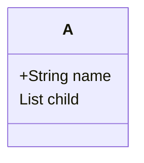

## 集合框架体系

### 迭代元素

#### 1、使用iterator

iterator是一个迭代器接口，通过实现这个接口可以定义自己的迭代器行为。Collection接口实现了Iterable接口，因此Collection下面的子类都是可迭代的。也就是可以通过iterator进行迭代。iterator有两个常用的方法：`hasNext()`和`next()`。这两个方法配合使用来迭代集合的元素。

#### 2、使用增强的for

增强的for实际上是一个简化的iterator，它的底层仍然是iterator。

## List

list是一种有序的集合结构，这就使得它可以使用索引的方式进行迭代。允许重复的元素，可以添加null。

### ArrayList

底层使用一个Object数组来实现，并且使用了transient关键字，transient关键字表示瞬间，短暂的，表示该属性不会被序列化。

#### 扩容机制

创建ArrayList的方法有两种，一个是无参构造，一个是有参构造。当使用无参构造的时候，第一次扩容将会扩成默认的容量大小10，然后后面的扩容每次增长为原来长度的1.5倍。如果使用的是有参构造，这时候会构造一个指定容量大小的数组，后面每次扩容的时候会增长为原来数组长度的1.5倍。

扩容并不是无限制的，当达到`Integer.MAX_VALUE-8`之后就会调用`hugeCapacity()`方法来设置一个最大的容量。

### Vector

vector的底层实现也是一个Object数组，vector是线程安全的。Vector的操作方法有`synchronized`关键字。它的扩容机制和ArrayList的扩容机制是类似的。有两种构造方法，无参构造方法将会构造一个默认容量为10的数组，然后每次扩容为原来数组长度的2倍，有参的构造方法将会构造一个容量为指定容量大小的数组，然后后面每次扩容为原来的2倍。

### LinkedList

LinkedList底层实现了双向链表，具有双端队列的特点。可以添加任意元素包括重复元素。维护了first和last变量，first指向双链表的头部，last指向双链表的尾部。

### ArrayList和LinkedList的对比

ArrayList是采用数组实现的，数组的特点是方便查询和修改，但是不方便增加或删除，因为数组是连续存储的结构，如果要增加或者删除的话，就需要大量移动元素来保证存储的连续性。大量移动元素是很低效的。

LinkedList是采用链表实现的，链表是离散的存储，它的特点是方便增删但是不方便查询和修改。

对于查询比较多的情况会使用ArrayList，对于需要进行大量增删的场景则使用LinkedList。

## Set

set是无序的一种存储结构，因此，它无法通过索引的方式进行获取元素。它不允许重复元素，可以加入null元素。

### HashSet

HashSet底层实际上是HashMap。当它添加一个元素的时候，它首先计算元素的hash值，然后将hash值转换成索引。然后查看这个索引位置是否已经有元素，如果有，就沿着链表依次向后使用equals方法进行比较，有相同元素存的话就放弃添加，否则就会添加在链表尾部。如果链表的长度超过一定的限制就会把链表转成一颗红黑树。

